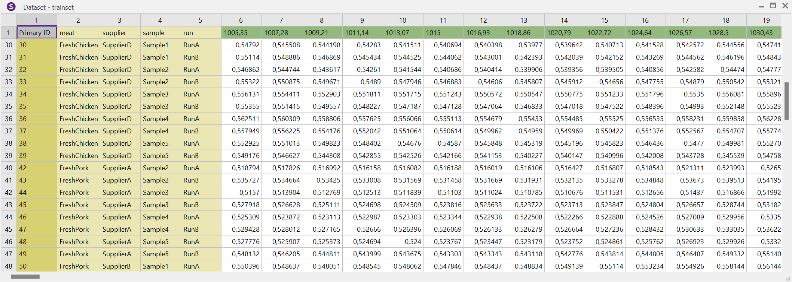

# The Dataset Interface: accessing datasets in SIMCA projects

The *Dataset* interface can be accessed from *Project* objects and it provides access to the datasets within the SIMCA project/file.

The *Dataset* interfaces can be accessed through the *Project* method *GetDataset()*. This method needs as a parameter the number of the dataset of interest within the SIMCA project. It is not straightforward to know this number. However, one can get it from the model index. All datasets withon a SIMCA project/file are associated within indices starting from 1 and up to the total number of datasets that can be retrieved from the *Project* method *GetNumberOfDatasets()*. Provided that we know (or find out) the index of the dataset of interest, we can get the associated dataset number by calling the Project method *GetDatasetNumberFromIndex(dataset_index)* that receives as a parameter the dataset index. Once we know the desired dataset number, we can create the *Dataset* object by running the Project method *GetDataset(dataset_of_interest_number)* that receives as a parameter the dataset number.

## An example:

To exemplify the use of the *Dataset* interface, we will go through the following example script. The script takes as input parameters the path of a SIMCA file and the name of the dataset of interest and it finds and prints to a csv file the dataset.

The beginning of the script resembles that of previous examples. FIrst, we import libraries and then, within the main function, we use the argparse library to associate with variables the input parameters pathSimcaProject (path to the SIMCA project) and datasetName (name of the dataset of interest withion the SIMCA project).

```
from win32com import client as win32
import argparse

if __name__ == '__main__':

    # Retrieve the name of the SIMCA project passed as a parameter
    # when calling the python script
    ap = argparse.ArgumentParser()
    ap.add_argument("-p", "--project", required=True, help="Path to the SIMCA project")
    ap.add_argument("-d", "--dataset", required=True, help="Dataset name")
    args = vars(ap.parse_args())
    pathSimcaProject = args["project"]
    datasetName = args["dataset"]
```

We then connect to the SIMCA-Q interface and create the *Project* object that loads the SIMCA project:
```
#Connect to the SIMCA-Q COM interface
try:
    #simcaq = win32.Dispatch('Umetrics.SIMCAQ')
    simcaq = win32.gencache.EnsureDispatch('Umetrics.SIMCAQ')
except:
    print('Could not connect to SIMCA-Q.')
    raise SystemExit

# Open the SIMCA project
project = simcaq.OpenProject(pathSimcaProject, "")
```

We iterate over the total number of datasets within the SIMCA project, which we get by using the *Project* method *GetNumberOfDatasets()*. The iteration variable accounts for the dataset index, and within each iteration we can get the dataset number associated with the corresponding index by invoking the *Project* method *GetDatasetNumberFromIndex(dataset_index)*. Then, we can call the *Dataset* interface and load the corresponding dataset by means of the *Project* method *project.GetDataset(dataset_of_interest_number)*. Once this is done, we can retrieve the name of the dataset by calling the *Dataset* method *GetDataSetName()*. If the retrieved dataset name coincides with that passed as an input parameter to the script, we leave the iteration and continue with the latest *Dataset* object. The code will look like:
```
#Retrieve the number of datasets in the SIMCA project
number_datasets = project.GetNumberOfDatasets() 
        
    
# Iterate over indices of all project datasets
for dataset_index in range(1, number_datasets+1):

    # The index does not neccesarily coincide wit the dataset number
    # But we need the dataset number to retrieve information in the dataset
    dataset_of_interest_number = project.GetDatasetNumberFromIndex(dataset_index)            

    # Once we know the model number, we can retrieve the ModelInfo interface
    # for the specific model
    dataset = project.GetDataset(dataset_of_interest_number)
            

    # Retrieve the name and type of the dataset of interest
    # from the Dataset object
    dataset_of_interest_name = dataset.GetDataSetName()

    # Leave the iteration if we have loaded a dataset with a name that
    # matches that passed to the main script as an input parameter i.e., datasetName
    if dataset_of_interest_name == datasetName:
        break
```

We can then retireve the number of observation IDs with the *Dataset* method *dataset.GetNumberOfObservationIDs()* and their names with the *Dataset* method *GetDataSetObservationIDName(i)* that receives as a parameter the observation ID index:
```
# Number of observation IDs in the dataset
n_observation_ids = dataset.GetNumberOfObservationIDs()

# List that will contain te names for the observation IDs
observation_ID_names = []
        
# Populating the list with the names of the observation IDs
for i in range(1,n_observation_ids+1):
    observation_ID_names.append(dataset.GetDataSetObservationIDName(i))
```

We can work with this code to find as well the values of the observation IDs for each observation. For this, for each observation ID we call the *Dataset* method *dataset.GetDataSetObservationNames(i)* that takes as a parameter the observation ID index. This method provides a *StringVector* object. We can now use the *StringVector* method *GetSize()* to infere the number of observations and *GetData(i)*, which takes as a parameter the observation number, to find the observation ID string associated with the specific observation:
```
# Number of observation IDs in the dataset
n_observation_ids = dataset.GetNumberOfObservationIDs()

# List that will contain te names for the observation IDs
observation_ID_names = []

# List of lists that will contain the value/string of the different
# observation IDS for each observation
observation_names = []
        
# Populating observation_ID_names and observation_names
for i in range(1,n_observation_ids+1):
    observation_ID_names.append(dataset.GetDataSetObservationIDName(i))
    temporal_list_observation_names = []
    obs_names = dataset.GetDataSetObservationNames(i)
    for observation_index in range(1,obs_names.GetSize()+1):
        temporal_list_observation_names.append(obs_names.GetData(observation_index))
    observation_names.append(temporal_list_observation_names)
```


